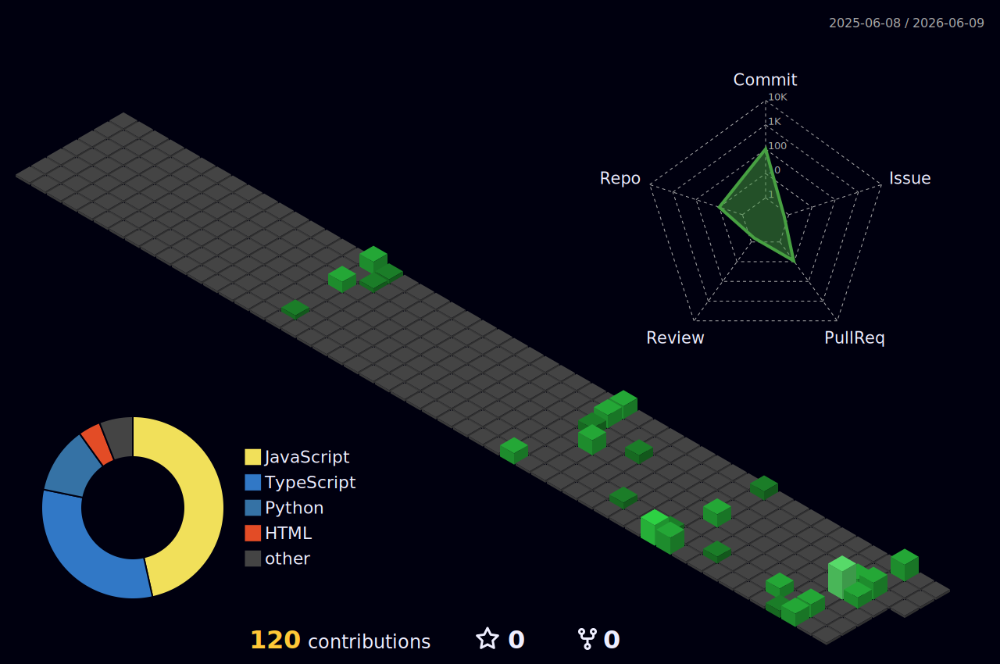

<!-- ANIMATED HEADER -->
<p align="center">
  
</p>

<!-- DYNAMIC TYPING SUBHEADER -->
<p align="center">
  <a href="https://git.io/typing-svg">
    
  </a>
</p>
<p align="center">
  
</p>
<p align="center">
  <picture>
    <source media="(prefers-color-scheme: dark)" srcset="https://raw.githubusercontent.com/Roshen-Reji/Roshen-Reji/output/github-contribution-grid-snake-dark.svg">
    <source media="(prefers-color-scheme: light)" srcset="https://raw.githubusercontent.com/Roshen-Reji/Roshen-Reji/output/github-contribution-grid-snake.svg">
    
  </picture>
</p>

---

### 👨‍💻 System Variables: `about_me.yml`

```yaml
---
user:
  name: "Roshen Reji Karivelil"
  status: "Engineering Student @ KTU"
  current_mission: "Webmaster @ IEEE SB CEK 2026"

focus_scenarios:
  software:
    - "Architecting scalable full-stack applications"
    - "Building cross-platform mobile UI/UX with Dart"
    - "Designing normalized SQL database schemas"
  hardware:
    - "Tinkering with ESP32-S3 Microcontrollers"
    - "Simulating digital sensors and embedded logic"
---
